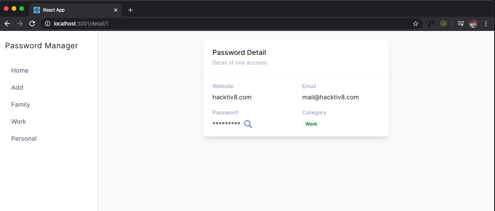

# Password Manager

> ⏰ Time limit: **150 min**

## Summary

Pada tugas kali ini kalian akan membuat sebuah aplikasi bernama `Password Manager`. Dalam aplikasi ini kalian akan menampilkan berbagai macam `Akun` beserta password yang sudah kalian simpan. Silahkan menggunakan `json-server` sebagai database pada aplikasi ini.

Skema dari aplikasi ini adalah sebagai berikut:

```JSON
{
  "password": [
    {
      "id": 1,
      "provider": "hacktiv8.com",
      "email": "mail@hacktiv8.com",
      "password": "Bethebest123",
      "category": "work"
    }
  ]
}
```

> Kalian dibebaskan untuk membuat design dari aplikasi ini selama fitur yang kita minta terpenuhi 😉

> Perhatikan juga penempatan element pada aplikasi kalian sehingga nyaman untuk dilihat oleh user 😉

## Competencies

- React
- React Router
- Redux
- Reusable Component

## Release 0

Buatlah sebuah halaman pada path `/` yang akan menampilkan kumpulan `Akun` yang tersedia.

Pada setiap item nya akan terdapat data:

- Nama website `Akun` tersebut.
- Email yang digunakan pada website tersebut.
- Category dari `Akun` tersebut.

Pada setiap item nya juga akan terdapat sebuah button sebagai berikut:

- `See Detail` sebuah button yang akan mengarahkan user ke halaman detail dari `Akun` tersebut.
- `Delete` button yang akan mengahpus `Akun` tersebut dari list.


**Rules**

- Data dari `Akun` wajib didapatkan dari `redux`.
- Fetch data `Akun` dari database harus melalui `action` di redux.

## Release 1

Buatlah sebuah form yang akan menambahkan `Akun` baru kedalam database kita. Kalian dapat membuat halaman baru / membuat modal untuk form ini.

Data yang dapat di input untuk `Akun` baru kita adalah `nama website`, `akun email`, `password` dan `category` yang merupakan select box dengan pilihan input `Work`, `Family` dan `Personal`.

Jika kalian menggunakan halaman baru pastikan user kembali ke halaman `/` ketika berhasil menyimpan data `Akun`.

Pastikan `Akun` yang baru kalian buat sudah terlihat pada list di halaman `/`


**Rules**

- Menyimpan data `Akun` ke database harus melalui `action` di redux.

## Release 2

Lakukanlah sebuah action ketika user menekan tombol `See Detail` yang ada di halaman utama. Action yang akan dilakukan adalah mengarahkan user ke halaman `/detail/:id` yang menampilkan detail dari `Akun` yang dipilih oleh user.

Data yang ditampilkan pada halaman `/detail/:id` adalah:

- Website dari `Akun` tersebut
- Email dari `Akun` tersebut
- Password dari `Akun` tersebut yang masih tersembunyi bisai diwakilkan dengan tanda `*********`
- Category dari `Akun` tersebut
- Sebuah button yang akan memperlihatkan text password `Akun` tersebut jika ditekan


<br />
<br />
<br />


**Rules**

- Data dari detail `Akun` wajib didapatkan dari `redux`.
- Fetch detail `Akun` dari database harus melalui `action` di redux.

## Release 3

Implementasikan button `delete` pada setiap item di halaman `/` yang akan menghapus data akun tersebut pada database,

**Rules**

- Aksi `Delete` harus melalui `action` di redux.
- Data yang berhasil dihapus tidak ditampilkan lagi pada kumpulan `Akun` di halaman `/`

## Release 4

Buatlah halaman dengan path `/family`, `/work`. `/personal` untuk menampilkan `Akun` yang memiliki category sesuai dengan path yang diminta.


> Menurut kalian berapa route yang kalian butuhkan untuk menyelesaikan release ini?

**Rules**

- Data dari `Akun` per category wajib didapatkan dari `redux`

## Release 5

Disaat kita membuat sebuah `Akun` baru maka buatlah sebuah validasi dengan ketentuan sebagai berikut:

- Semua input harus terisi sebelum menyimpan data ke database.
- Panjang password yang dapat diinput harus melebihi 6 karakter.
- Tampilkan sebuah feedback ketika ada data yang belum terisi pada form, feedback ini dapat berbentuk modal/alert tetapi tidak diperbolehkan menggunakan fungsi `alert()` javascript.


